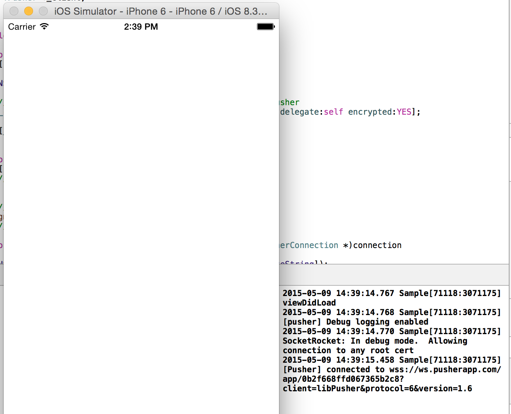
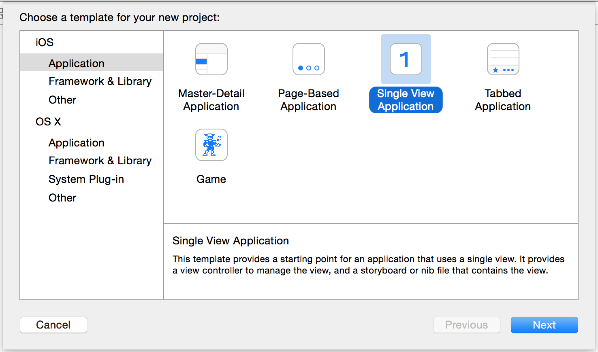
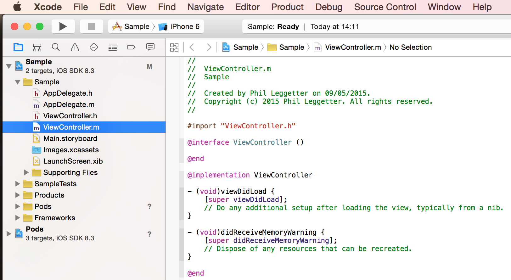

# Pusher libPusher iOS/OSX Objective-C Basics

This repo provides a very basic iOS application that you can use to get started using [libPusher][libPusher] for with Pusher.

It provides details of:

1. [How to install and use cocoapods]()
2. [How to use this Pusher Basics project]()
3. [How to create a new Pusher iOS project from scratch]()

Similar steps can be used for OSX projects.

[libPusher]: https://github.com/lukeredpath/libpusher

## How to install and use cocoapods

CocoaPods is the dependency manager for Swift and Objective-C Cocoa projects. You use it to install libPusher as a dependency for your iOS/OSX project, and thus add Pusher functionality to your app.

### Install cocoapods

You'll need [cocoapods](https://cocoapods.org/) installed.

```
sudo gem install cocoapods
```

### Make sure you can use the `pod` executable

Once installed check to see if the `pod` executable is available to you.

If not, determine where it is:

```
› gem which cocoapods
/Users/leggetter/.rbenv/versions/2.1.0/lib/ruby/gems/2.1.0/gems/cocoapods-0.37.1/lib/cocoapods.rb
```

Then you can call the `pod` directly via something like:

```
/Users/leggetter/.rbenv/versions/2.1.0/bin/pod
```

## How to use this Pusher Basics project

The following steps will show you how to run the project within this repo.

Ensure you've read the section on [installing and using cocoapods](#).

### Get the code

Clone the repo locally:

```
git clone git@github.com:leggetter/pusher-ios-basics.git
```

Navigate to the repo:

```
cd pusher-ios-basics
```

### Install libPusher & Dependencies

Use cocoapods to install the Pusher Basics application dependencies.

```
/Users/leggetter/.rbenv/versions/2.1.0/bin/pod install
```

You'll see the following output:

```
› /Users/leggetter/.rbenv/versions/2.1.0/bin/pod install
Analyzing dependencies
Downloading dependencies
Installing SocketRocket (0.3.1-beta2)
Installing libPusher (1.6)
Generating Pods project
Integrating client project
```

### Open with Xcode

Within the `pusher-ios-basics` open `PusherBasics.xcworkspace` with Xcode.

### Add your own Pusher Application Key

Update `PusherBasics/ViewController.m`. Replace `YOUR_APP_KEY` in the following line with your Pusher application key.

```
_client = [PTPusher pusherWithKey:@"YOUR_APP_KEY" delegate:self encrypted:YES];
```

### Run the project

Run the application. Although there is no UI you'll see from the output window that a connection has been established.



```
2015-05-09 14:39:14.767 Sample[71118:3071175] viewDidLoad
2015-05-09 14:39:14.768 Sample[71118:3071175] [pusher] Debug logging enabled
2015-05-09 14:39:14.770 Sample[71118:3071175] SocketRocket: In debug mode.  Allowing connection to any root cert
2015-05-09 14:39:15.458 Sample[71118:3071175] [Pusher] connected to wss://ws.pusherapp.com/app/0b2f668ffd067365b2c8?client=libPusher&protocol=6&version=1.6
```

From here you can implement any additional functionality that you require.


## How to create a new Pusher iOS project from scratch

Below you'll find details of how to create a project that uses [libPusher][libPusher].

Ensure you've read the section on [installing and using cocoapods](#).

### Create a project in Xcode

For the purposes of this we'll create a `Sample` project in `~/tmp`. So that the rest of the steps match create a "Single View Application".



### Create a `Podfile`

Within `~/tmp/Sample` create a file called `Podfile` and set the contents as to:

```
platform :ios, '6.0'
pod 'libPusher', '1.6'
```

### Install `libPusher` pod and dependencies

Within `~/tmp/Sample` execute:

```
/Users/leggetter/.rbenv/versions/2.1.0/bin/pod install
```

You'll get output similar to the following:

```
› /Users/leggetter/.rbenv/versions/2.1.0/bin/pod install
Analyzing dependencies
Downloading dependencies
Installing SocketRocket (0.3.1-beta2)
Installing libPusher (1.6)
Generating Pods project
Integrating client project

[!] Please close any current Xcode sessions and use `Sample.xcworkspace` for this project from now on.
```

Close the existing Xcode project and open `Sample.xcworkspace` in Xcode.



### Adding libPusher

Adding libPusher is now as simple as adding the following to the top of `Sample/ViewController.m`:

```objective-c
#import <Pusher/Pusher.h>
```

### Create a `PTPusher` instance

Declare that the `ViewController` implements the `PTPusherDelegate` and define a `PTPusher` variable:

```objective-c
@interface ViewController ()<PTPusherDelegate> {
    PTPusher *_client;
}
@end
```

In the `ViewController#viewDidLoad` create a new `PTPusher` instance:

```objective-c
@implementation ViewController

- (void)viewDidLoad {
    [super viewDidLoad];
    
    NSLog(@"viewDidLoad");
    
    // self.client is a strong instance variable of class PTPusher
    _client = [PTPusher pusherWithKey:@"YOUR_KEY" delegate:self encrypted:YES];
    
    [_client connect];
}

// Other methods

@end
```

Notice that we're also connecting by calling `connect`.

### Ensure we're connecting

So that we can confirm that we're connecting to Pusher add the following `PTPusherDelegate`:

```objective-c

@implementation ViewController

// Other methods

//////////////////////////////////
#pragma mark - Pusher Delegate Connection
//////////////////////////////////

- (void)pusher:(PTPusher *)pusher connectionDidConnect:(PTPusherConnection *)connection
{
    NSLog(@"[Pusher] connected to %@", [connection.URL absoluteString]);
}

- (void)pusher:(PTPusher *)pusher connection:(PTPusherConnection *)connection failedWithError:(NSError *)error
{
    if (error) {
        NSLog(@"[Pusher] connection failed: %@", [error localizedDescription]);
    } else {
        NSLog(@"[Pusher] connection failed");
    }
}

- (void)pusher:(PTPusher *)pusher connection:(PTPusherConnection *)connection didDisconnectWithError:(NSError *)error willAttemptReconnect:(BOOL)reconnect
{
    if (error) {
        NSLog(@"[Pusher] didDisconnectWithError: %@ willAttemptReconnect: %@", [error localizedDescription], (reconnect ? @"YES" : @"NO"));
    } else {
        NSLog(@"[Pusher] disconnected");
    }
}

@end
```

### Run the app

Run the application. Although there is no UI you'll see from the output window that a connection has been established.


```
2015-05-09 14:39:14.767 Sample[71118:3071175] viewDidLoad
2015-05-09 14:39:14.768 Sample[71118:3071175] [pusher] Debug logging enabled
2015-05-09 14:39:14.770 Sample[71118:3071175] SocketRocket: In debug mode.  Allowing connection to any root cert
2015-05-09 14:39:15.458 Sample[71118:3071175] [Pusher] connected to wss://ws.pusherapp.com/app/0b2f668ffd067365b2c8?client=libPusher&protocol=6&version=1.6
```

From here you can implement any additional functionality that you require.
